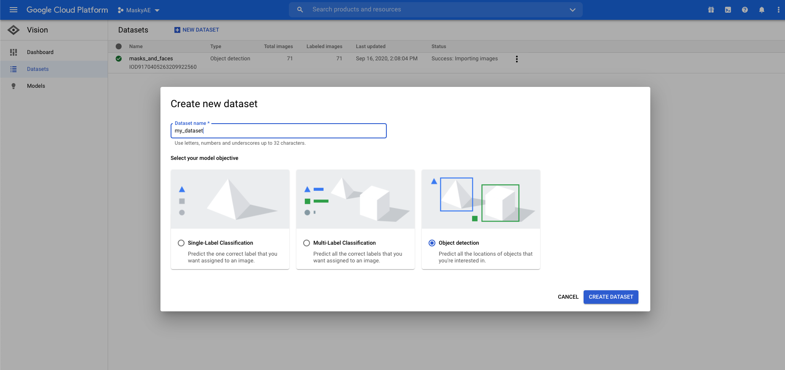
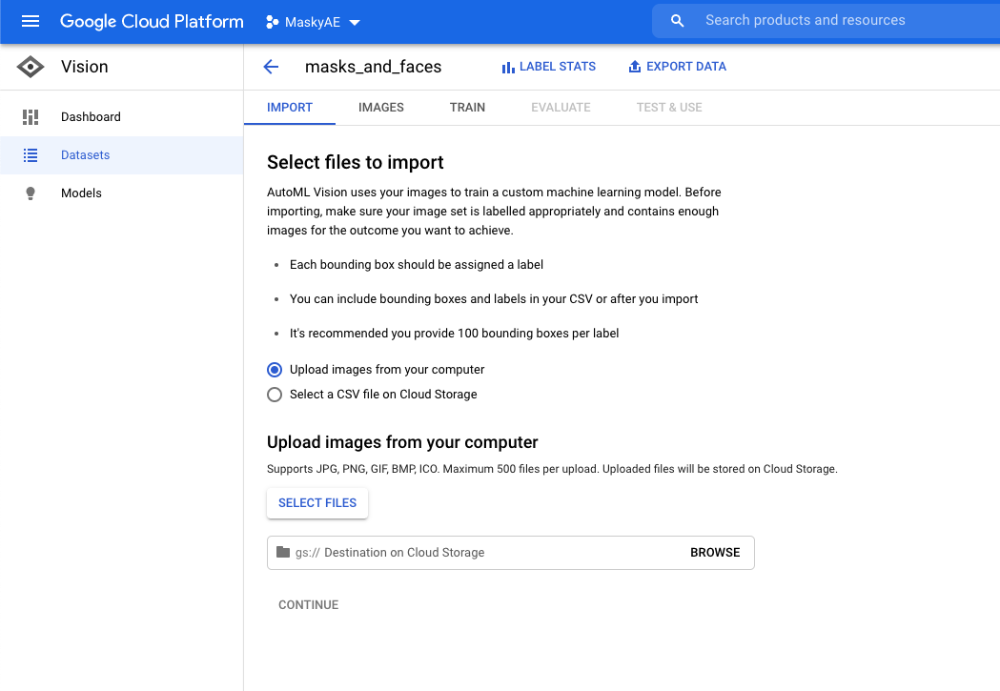
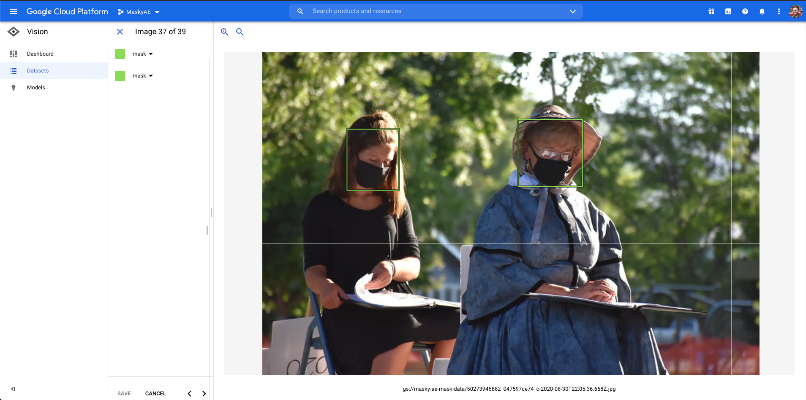

# Easy client-side inference with AutoML and React

Neural-network-based object detection is a powerful technique that's getting easier and easier to take advantage of. With Google's [Cloud AutoML] computer vision service (as well as similar services like Microsoft's [Custom Vision](https://azure.microsoft.com/en-us/services/cognitive-services/custom-vision-service/)), it's now surprisingly easy and cheap to train a powerful object detection model and deploy it as a client-side React app. And best of all, you don't need to hire a data scientist to do it - the model training is code-free, so any application developer can train a model and focus on doing what they do best, which is building useful and fun applications!

Given the current state of the world with COVID-19, we thought it would be an interesting test case to try building a mask detector - something that could take a video stream, and report back on the locations of people in a frame who are wearing masks, and of those who aren't. This could potentially be pretty useful to deploy in businesses trying to enforce mask mandates, and ride sharing services are already using something similar to check that drivers and riders are wearing masks.

To keep it light though, in this case the detector isn't reporting anything to anyone - it'll just draw bounding boxes around detected masked and unmasked faces.

If you want to skip the explanations and jump into the code, you can find the deployed project (with some extra sounds and visual effects) at [doctormasky.com](https://doctormasky.com), and the repo [on GitHub](https://github.com/agencyenterprise/masky).

## End-to-end workflow

The end-to-end workflow for building a client-side object detector goes like this. First you sign up for a Google AutoML account, and find example images of the objects you want to detect. You can find these online, with a public dataset, or by taking them yourself. Then you upload the images to a Google Storage bucket, and label the dataset by drawing bounding boxes around the objects in the images. Google then uses that labeled data to create a model. You can deploy that model as endpoint to send images to. Or in this case, you can export that model to another Google Storage bucket, and use it for on-device detection within a webapp.

On the webapp side, you can use Google's [tfjs-automl](https://github.com/tensorflow/tfjs/tree/master/tfjs-automl) library to download and initialize your model. Then you connect to the device's camera, set up a `video` element to both show the user and to process the data into a video stream to periodically send to the model. The model will report back with the locations and labels of detected objects. You can use that to draw SVG images around the detected objects, play sounds, send the detected objects to some other service, or whatever else you want to do with that information. And in this case, we're using React to set up the app and handle the data flow and SVG drawing.

If that sounds like something you want to do, then read on to learn how to make it happen!

## Model creation

So first you need to find upload example images of each object type you want to detect (in this case, people wearing masks and people without masks). The more images the better, but because AutoML uses transfer learning from a pre-trained object detection model, even just 30 examples for each class will probably give you decent results - though a hundred of each class would be better. Once you've uploaded the images, you use Google's UI to manually draw bounding boxes around the objects (faces with and without masks in our case) in each image, and label each bounding box with its associated class. After all your data is labeled, you just tell Google to train the model, and come back in a couple hours. When it's done, you'll have a model to deploy as an API, or to use for client-side detection. The second option is what we'll focus on today.

Before you create a model, you'll have to set up a Google Cloud project, add billing, and enable the AutoML and Cloud Storage APIs. You can follow Google's [edge device model quickstart docs](https://cloud.google.com/vision/automl/docs/edge-quickstart) to get all that set up. You do have to provide a credit card to enable the API, but the first 15 node hours (training is run on multiple nodes in parallel) of training is free. See the [docs](https://cloud.google.com/vision/automl/pricing#automl-vision-edge) for more pricing information. You can train a basic model in a few node hours, so the first few training runs will be free, and it's \$18 per node hour after that.

Once you've got the AutoML Vision set up, you can start adding images! Sourcing the right images can be the hardest part of training a model. [Flikr](https://www.flickr.com/) is a good source for Creative-Commons-licensed images. Depending on what objects you're trying to detect, you could also take the images yourself, or use a public dataset from somewhere like [Kaggle](https://www.kaggle.com/datasets). In any case, make sure you get a verity of angles and backgrounds to make sure the model has a robust training set to learn from. And if you're doing something like face detection, make sure you train on a diverse set of people, or your model won't perform well on everyone.

With your images collected, you can create a new AutoML dataset to import into. Create a new dataset, and choose Object Detection. Classification can also be useful if you don't need the specific location of the detected items, but for any kind of AR experience you're probably going to want those bounding boxes.



Next, click on your new dataset and go to the Import tab. This will let you upload the new images. If there's in an existing Google Storage bucket, you can import them directly too.



With the images imported, go to the Images tab, click on an image, and start drawing bounding boxes! For this project we need two labels - `mask` and `face`. Make sure to pick the correct label in the top left area of the screen. If there are multiple objects in the image, you can mark each one with its own bounding box.



Finally, it's time to train your model! Go to the Train tab, and click Start Training. You'll have to pick either a Cloud Hosted or Edge model. For this tutorial you want Edge, since we'll be running inferences on the user's device. I'd also pick "Optimize for faster predictions", since inferences will be running pretty frequently on the video stream. Finally you'll have to pick a node hour budget. When getting started, I'd go for only an hour or two, to keep in the free tier. If you have more budget, then you can go for a full 24 hours. In any case, the training will stop as soon as the model converges, and you'll only be billed for the hours you actually use.

Then just click Start Training. You'll get an email when it's done. In the meantime, you can go do something else, or start looking at the React half of the project! Once you get that email, congrats, you just trained a neural network!

The last step is to actually get the model. Click the TensorFlow.js option on the Test & Use tab, and export it to a bucket. You can then download it and add it to your react project. Or, just make the bucket public (see [the Google Storage docs](https://cloud.google.com/storage/docs/access-control/making-data-public#buckets) for how to do that), and you can reference it directly from your React code! Speaking of which, it's now time to start writing some React.

## React app

Step one with a React project, as always, [Create React App](https://reactjs.org/docs/create-a-new-react-app.html). We'll call the project Masky, so the command is `npx create-react-app masky` (or `npx create-react-app masky --template typescript`, if you want a TypeScript app).

Then, you'll need to add [tfjs](https://github.com/tensorflow/tfjs) for client-side inference, and [tfjs-automl](https://github.com/tensorflow/tfjs/tree/master/tfjs-automl) to use the AutoML model.

```bash
yarn add @tensorflow/tfjs @tensorflow/tfjs-automl
```

For this tutorial we're also using [Emotion](https://emotion.sh/), but feel free to use whatever styling solution you'd like.

```bash
yarn add @emotion/core @emotion/styled
```

The basic flow of a webcam-connected TF.js app works like this - you connect to the user's webcam with [navigator.mediaDevices.getUserMedia](https://developer.mozilla.org/en-US/docs/Web/API/MediaDevices/getUserMedia), and send the stream to a `video` element. Once the webcam is connected, you can start a timer to periodically send a `ref` of the `video` element to the model. It'll report back with the locations of detected objects (if any). Then you can use that data to show a message on the screen, or use SVGs to render bounding boxes, little COVID viruses, or whatever you want on top of the video. So, there's some state to manage here, and because the setup process takes a few seconds you'll probably want to show status messages to the user so they don't think the app is broken. Let's get to work!

## Styling

You can start by adding a `video` element, plus some styling to make it take up the whole screen but leave room for status messages. The video stream will be different dimensions depending of the device, so it's a good idea to use absolute positioning to center it in a parent `div`. Also make sure to add `autoPlay`, `muted`, and `playsInline` to the `video` element, or the video stream won't actually start.

Also, make sure to add `transform: scaleX(-1);` to the video CSS - that flips the video, so it acts like a mirror. Otherwise moving your head left will move your on-screen head to the right, which feels weird.

We'll also set up the wrapping div to change color based on what's detected - green for masks, red for unmasked faces.

```tsx
/** @jsx jsx */
import { jsx, Global } from "@emotion/core";
import css from "@emotion/css/macro";
import styled from "@emotion/styled/macro";
import { FunctionComponent } from "react";

const modelUrl = `https://storage.googleapis.com/path/to/model.json`;

export const App: React.FunctionComponent = () => {
  return (
    <PredictionWrapper status="none">
      <GlobalStyle />
      <Message>Doctor Masky</Message>

      <VideoContainer>
        <Video autoPlay muted playsInline />
      </VideoContainer>

      <Message>Status Message Here</Message>
    </PredictionWrapper>
  );
};

export const GlobalStyle = () => {
  return (
    <Global
      styles={css`
        html,
        body,
        #root {
          height: 100%;
        }

        body {
          margin: 0;
        }
      `}
    />
  );
};

export const detectionColor: Record<string, string> = {
  loading: "black",
  face: "red",
  mask: "green",
  both: "orange",
  none: "black",
};

const PredictionWrapper = styled.div<{ status: string }>`
  width: 100%;
  height: 100%;
  position: relative;
  display: flex;
  flex-direction: column;
  justify-content: space-between;
  background: ${({ status }) => detectionColor[status]};
`;

const VideoContainer = styled.div`
  position: relative;
  flex-grow: 1;
  flex-shrink: 1;
`;

const Video = styled.video`
  position: absolute;
  width: 100%;
  height: 100%;
  /* Flip video */
  transform: scaleX(-1);
  flex-grow: 1;
`;

const Message = styled.div`
  padding: 1rem 0;
  color: white;
  font-size: 3rem;
  text-align: center;
`;
```

With the styling out of the way, we can actually get the webcam stream set up. That'll require a hook to manage the state, which will handle connecting to the camera and connecting the camera to the video element's `ref`.

This will use `navigator.mediaDevices.getUserMedia({video: { facingMode: 'user' }})` to get the video stream. The `facingMode` tells the browser which camera to use if the device has more than one, like a smartphone. Then we'll create a `HTMLVideoElement` ref that we'll pass to the `video` element, and will use that to pass the camera stream to the `video`.

Finally, the hook will return the `ref` to be sent to the `video`, and a `status` string that's helpful for letting the user know how the setup process is going. There's also a little error handling code, but in practice I haven't seen any errors.

## Initialize the camera

```typescript
import { useRef, useEffect, useState } from "react";

export type WebcamStatus = "waiting" | "connected" | "failed";

const defaultVideoConstraints = { facingMode: "user" };

export const useWebcam = (
  videoConstraints: MediaTrackConstraints = defaultVideoConstraints
): [React.MutableRefObject<HTMLVideoElement | null>, WebcamStatus] => {
  const videoRef = useRef<HTMLVideoElement | null>(null);
  const [status, setStatus] = useState<WebcamStatus>("waiting");

  useEffect(() => {
    // Get video stream
    navigator.mediaDevices
      .getUserMedia({ video: videoConstraints })
      .then((stream) => {
        if (videoRef.current) {
          videoRef.current.srcObject = stream;
          setStatus("connected");
        } else {
          console.error("Webcam connected before video was ready.");
          setStatus("failed");
        }
      })
      .catch((error) => {
        console.error(error);
        setStatus("failed");
      });
  }, [videoConstraints]);

  return [videoRef, status];
};
```

With that code written, we can add the hook to the `App` component, and pass the `ref` to the `<video>`.

```tsx
import { useWebcam } from "./lib/useWebcam";

export const App: FunctionComponent = () => {
  // use the new hook
  const [videoRef, status] = useWebcam();

  return (
    <PredictionWrapper status="none">
      <GlobalStyle />
      <Message>Doctor Masky</Message>
      <VideoContainer>
        <Video
          autoPlay
          muted
          playsInline
          // Pass the ref to the video.
          ref={videoRef}
        />
      </VideoContainer>

      {/* Show the video status. */}
      <Message>{status}</Message>
    </PredictionWrapper>
  );
};
```

Now run `yarn start` to serve the app, and you should see yourself. Hello world!


### Load the model

So now you can see yourself, give yourself a high five! But we still don't know if you're wearing your mask or not. Let's fix that. To do this next part, you'll need a trained model, so you'll have to wait for that to finish training, if it hasn't already.

`tfjs-automl` is really simple to use, and loading the model is no exception. You just have to call `automl.loadObjectDetection`, which will return a Promise of a model. A simple React hook will do the job nicely:

```typescript
// src/lib/useDetectionModel.ts

import { useState, useEffect } from "react";
import * as automl from "@tensorflow/tfjs-automl";

export const useDetectionModel = (
  modelUrl: string
): automl.ObjectDetectionModel | null => {
  const [model, setModel] = useState<automl.ObjectDetectionModel | null>(null);

  useEffect(() => {
    automl.loadObjectDetection(modelUrl).then(setModel);
  }, [modelUrl]);

  return model;
};
```

You just need to pass the URL of the `model.json` to `useDetectionModel`. The `model.json` will then tell the library about the other files it'll need to download. If you're hosting the model in a Google Storage bucket (and have it set up as a public bucket), then you can pass in its URL. Otherwise, you can add the model to the `public` directory of the app and pass a relative URL here.

```tsx
// src/App.tsx

import React from "react";

import { useDetectionModel } from "./lib/useDetectionModel";

const modelUrl = `https://storage.googleapis.com/path/to/model.json`;

export const App: React.FunctionComponent = () => {
  const detectionModel = useDetectionModel(modelUrl);

  return <PredictionWrapper>{/* ... */}<PredictionWrapper>
};
```

When you refresh the page, you should now see the `model.json`, a `dict.txt`, and some `shard` files get downloaded. You're ready to detect!

## Start Detecting

Now that the model is loaded and the camera is connected, it's time to bring them together. The automl library makes it pretty easy, but there's still some work to do to manage the state. So it's time for another custom hook. This one will take the `videoRef` that we'll use to get frames from, the model, and an interval to run the model on. Detection is pretty fast, but no so fast that you'll want to run it on every frame. I found once a second to be fine for this application.

The first thing to deal with is that you can't start detecting until the camera and video and initialized - otherwise the model will throw an error. So we'll add a `useState` hook to track when the video is ready, as well as a `useState` for actually holding the current detection state.

```typescript
export type PredictedObjects = automl.PredictedObject[] | null;

export const useDetection = (
  model: automl.ObjectDetectionModel | null,
  videoRef: React.MutableRefObject<HTMLVideoElement | null>
): [automl.PredictedObject[] | null, () => void] => {
  const [detections, setDetections] = useState<PredictedObjects>(null);
  const [videoReady, setVideoReady] = useState(false);

  const onVideoReady = useCallback(() => setWebcamReady(true), [setVideoReady]);

  return [detections, onVideoReady];
};
```

Then you can just call `onVideoReady` when the `video` is initialized:

```tsx
import { useWebcam } from "./lib/useWebcam";

export const App: FunctionComponent = () => {
  // ...
  // Use the new hook
  const [detections, onVideoReady] = useDetection();

  return (
    <PredictionWrapper status="none">
      {/* ... */}
      <Video
        autoPlay
        muted
        playsInline
        ref={videoRef}
        // Record when the video is ready
        onLoadedData={onVideoReady}
      />
      {/* ... */}
    </PredictionWrapper>
  );
};
```

With that bit of state management set up, we can actually start doing detections. It's surprisingly straightforward - using `setInterval`, just call `model.detect` with `videoRef.current` on a timer, and save the result with `setDetections`. It really couldn't be simpler.

```typescript
export const DETECTION_INTERVAL = 500;
export const DETECTION_THRESHOLD = 0.65;

export const useDetection = (
  model: automl.ObjectDetectionModel | null,
  videoRef: React.MutableRefObject<HTMLVideoElement | null>
): [PredictedObjects, () => void] => {
  const [detections, setDetections] = useState<PredictedObjects>(null);
  const [videoReady, setVideoReady] = useState(false);

  const onVideoReady = useCallback(() => setVideoReady(true), [setVideoReady]);

  useEffect(() => {
    const video = videoRef.current;
    // Only run detections after the video and model are initialized.
    if (!videoReady || !model || !video) return;

    const detect = (video: HTMLVideoElement) =>
      // Run the model, and ignore low-probability detections.
      model.detect(video, { score: DETECTION_THRESHOLD });

    // First run
    detect(video).then(setDetections);

    // Schedule detections.
    const handle = setInterval(
      () => detect(video).then(setDetections),
      DETECTION_INTERVAL
    );

    // Clean up the interval if the useEffect is re-run.
    return () => {
      clearInterval(handle);
    };
  }, [videoReady, model, videoRef, setDetections]);

  return [detections, onVideoReady];
};
```

There is one more thing to think about - the first prediction actually takes a few seconds while the model warms up, but after that it's much faster. So to speed things up, we can "warm up" the model while the video is connecting, and then it'll be ready to immediately start doing quick detections. To do that, you just need to pass an empty tensor to the model:

```typescript
const warmUp = (model: automl.ObjectDetectionModel) => {
  const dummyImage = tf.zeros<tf.Rank.R3>([3, 3, 3]);
  model.detect(dummyImage);
};
```

and then call that function in a `useEffect` when the model is set up:

```typescript
export const DETECTION_INTERVAL = 500;
export const DETECTION_THRESHOLD = 0.65;

export const useDetection = (
  model: automl.ObjectDetectionModel | null,
  videoRef: React.MutableRefObject<HTMLVideoElement | null>
): [PredictedObjects, () => void] => {
  const [detections, setDetections] = useState<PredictedObjects>(null);
  const [videoReady, setVideoReady] = useState(false);

  const onVideoReady = useCallback(() => setVideoReady(true), [setVideoReady]);

  // Warm up model while the camera is connecting.
  useEffect(() => {
    if (model) {
      warmUp(model);
    }
  }, [model]);

  useEffect(() => {
    const video = videoRef.current;
    if (!videoReady || !model || !video) return;

    const detect = (video: HTMLVideoElement) =>
      model.detect(video, { score: DETECTION_THRESHOLD });

    detect(video).then(setDetections);

    const handle = setInterval(
      () => detect(video).then(setDetections),
      DETECTION_INTERVAL
    );

    return () => {
      clearInterval(handle);
    };
  }, [videoReady, model, videoRef, setDetections]);

  return [detections, onVideoReady];
};
```

And that's it! Add a `console.log(detections)` to the hook, and when the app reloads, you should see it connect, and then start logging bounding box locations, tagged as either `face` or `mask`. Neat!

## Detection status

So getting the detection locations is cool, but the user can't actually see the result yet. The first thing we can show the user is a status - is there anyone without a mask on screen? If there is, we'll set the whole thing to be a scary red color. In the first style step, we set the `PredictionWrapper` div up to handling the styling part, so now it's time to use that!

Every detected object has a label, so we just have to count up the detected faces and masks, and use that to calculate a status:

```typescript
export type DetectionStatus = "loading" | "none" | "face" | "mask" | "both";

export const getDetectionStatus = (detections: PredictedObject[] | null) => {
  if (!detections) {
    return "loading";
  }

  let masks = 0;
  let faces = 0;

  detections.forEach((detection) => {
    if (detection.label === "mask") {
      masks += 1;
    } else if (detection.label === "face") {
      faces += 1;
    }
  });

  return statusFromCounts(masks, faces);
};

const statusFromCounts = (masks: number, faces: number): DetectionStatus => {
  if (masks > 0 && faces > 0) {
    return "both";
  }
  if (masks > 0) {
    return "mask";
  }
  if (faces > 0) {
    return "face";
  }
  return "none";
};
```

To tell the user what that color means, it'd also be nice to have a status message. That message will let the user know that the model is getting set up, then show what the model has detected. It will just take the video and detection status values, and return a message.

```typescript
export const webcamStatusMessage: Record<WebcamStatus, string> = {
  waiting: "Waiting for camera...",
  connected: "Loading model...",
  failed: "Couldn't connect to camera.",
};

export const detectionMessage: Record<DetectionStatus, string> = {
  loading: "Loading model...",
  none: "I'm not sure. Try getting closer to the screen.",
  both: "Ask your friends to put on a mask!",
  face: "Don't forget your mask!",
  mask: "Thanks for wearing a mask!",
};

export const getMessage = (
  detectionStatus: DetectionStatus,
  webcamStatus: WebcamStatus,
  started: boolean = true
): string => {
  if (detectionStatus === "loading") {
    return webcamStatusMessage[webcamStatus];
  } else if (!started) {
    return "Ready to start";
  } else {
    return detectionMessage[detectionStatus];
  }
};
```

Then we can use those functions in the component to color the whole site and show the message:

```tsx
export const App: FunctionComponent = () => {
  const detectionModel = useDetectionModel(modelUrl);
  const [videoRef, status] = useWebcam();
  const [detections, onVideoReady] = useDetection(detectionModel, videoRef);

  // Calculate status
  const detectionStatus = getDetectionStatus(detections);

  return (
    // Pass the status to the background.
    <PredictionWrapper status={detectionStatus}>
      <GlobalStyle />
      <Message>Doctor Masky</Message>

      <VideoContainer>
        <Video
          autoPlay
          muted
          playsInline
          hide={!detections}
          ref={videoRef}
          onLoadedData={onVideoReady}
        />
      </VideoContainer>

      {/* Print the status message */}
      <Message>{getMessage(detectionStatus, status)}</Message>
    </PredictionWrapper>
  );
};

export const detectionColor: Record<string, string> = {
  loading: "black",
  face: "red",
  mask: "green",
  both: "orange",
  none: "black",
};

const PredictionWrapper = styled.div<{ status: string }>`
  /* Use the status. */
  background: ${({ status }) => detectionColor[status]};
`;
```

With all that set up, you've got yourself a working on-device mask classifier!


## Drawing bounding boxes

A classifier is already pretty useful. But we trained a detector, not a classifier, so the model knows specifically where the mask-less offenders are. The [doctormasky.com](https://doctormasky.com) app draws viruses on maskless faces, but to keep it simple for this tutorial, we'll just draw boxes around the detected faces. You could do that with simple divs or a canvas, but an easy approach is with an inline SVG.

Here's the plan: we'll absolutely position an SVG container that covers the video, and has the same viewBox size as the video. Then, we can use the label and position data returned from the model to draw boxes with the right colors around detected faces.

Step one is to draw the SVG, and set its viewBox to match the video. That'll mean that the video coordinates will match the svg coordinate system, which will make everything easier.

```tsx
export const App: FunctionComponent = () => {
  const detectionModel = useDetectionModel(modelUrl);
  const [videoRef, status] = useWebcam();
  const [detections, onVideoReady] = useDetection(detectionModel, videoRef);

  const detectionStatus = getDetectionStatus(detections);

  return (
    <PredictionWrapper status={detectionStatus}>
      {/* ... */}

      <VideoContainer>
        <Video
          autoPlay
          muted
          playsInline
          hide={!detections}
          ref={videoRef}
          onLoadedData={onVideoReady}
        />

        {videoRef.current && (
          // Use the video ref to set the width and height.
          <SvgContainer
            viewBox={`0 0 ${videoRef.current.videoWidth} ${videoRef.current.videoHeight}`}
          ></SvgContainer>
        )}
      </VideoContainer>

      {/* ... */}
    </PredictionWrapper>
  );
};

const SvgContainer = styled.svg`
  position: absolute;
  top: 0;
  left: 0;
  width: 100%;
  height: 100%;
  /* Flip video */
  transform: scaleX(-1);
`;
```

Usually using `${videoRef.current.videoWidth}` to get an element size isn't a good idea, since it's not updated when the screen changes. In this case, there will be a render cycle every second when there's a new detection, which will fetch the data. So, we won't worry about it.

Also, note we need the same `transform: scaleX(-1);` style as on the video. If you forget this, bounding boxes will be on the wrong side of the screen, which is a very weird experience.

With the SVG set up, it's simple to draw SVG rectangles around the detected bounding boxes:

```tsx
export const App: FunctionComponent = () => {
  const [videoRef, status] = useWebcam();
  {
    /* Hooks... */
  }

  return (
    <PredictionWrapper status="none">
      {/* ... */}

      <VideoContainer>
        <Video
          autoPlay
          muted
          playsInline
          hide={!detections}
          ref={videoRef}
          onLoadedData={onVideoReady}
        />

        {videoRef.current && (
          <SvgContainer
            viewBox={`0 0 ${videoRef.current.videoWidth} ${videoRef.current.videoHeight}`}
          >
            {detectedObjects.boxes.map((detection) => {
              const { box, label } = detection;
              const { left, top, width, height } = box;
              return (
                <rect
                  key={`${left}-${top}-${label}`}
                  x={left}
                  y={top}
                  width={width}
                  height={height}
                  stroke={detectionColor[label]}
                  fill="transparent"
                  strokeWidth="5"
                />
              );
            })}
          </SvgContainer>
        )}
      </VideoContainer>

      {/* ... */}
    </PredictionWrapper>
  );
};

export const detectionColor: Record<string, string> = {
  loading: "black",
  face: "red",
  mask: "green",
  both: "orange",
  none: "black",
};
```

And that's really it! Aligning the SVG with the video means you can use the automl bounding boxes without any special processing.


And with that, we're done! You've trained an object detection neural network, exported it to run on edge devices to protect your users' privacy, hooked the model into a live video stream, and even arguably made a simple Augmented Reality app. And of course, you helped fight COVID-19. Not bad!

There's all kinds of things you could do with this tech - if you want a webapp to understand what it's looking at, you've got the tools now. And if you'd like help setting up the next big ML app, [hit us up](https://ae.studio)!

Stay safe out there!
